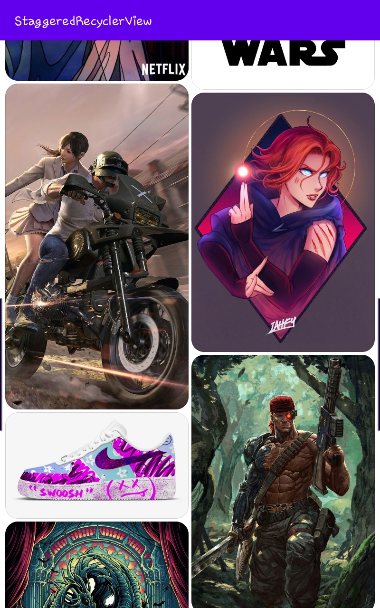

# Staggered-Grid-View
Practicing Staggered Grid View for a project I'm working on

## Description
This is just practice for a bigger thing that's coming up

## Note
**Courtesy of [Pinterest](https://www.pinterest.com/) for the images**

## Screenshots
**Screen shot 1**
--

**Screen shot 2**
--

**Screen shot 3**
--

